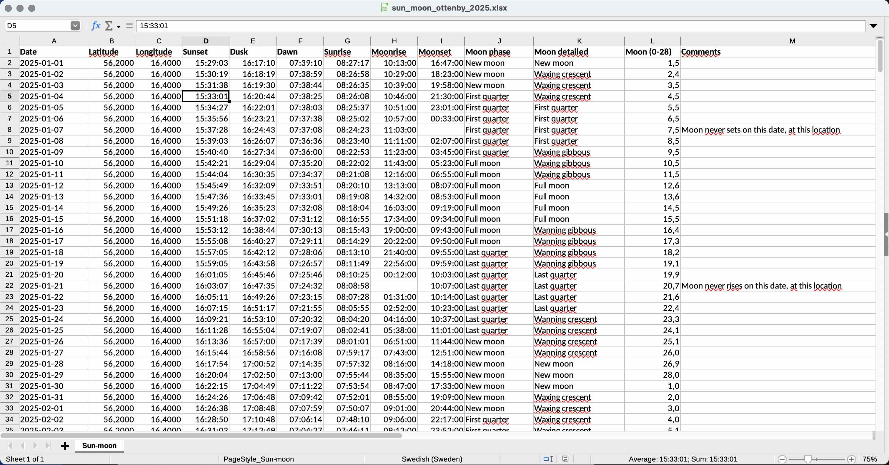
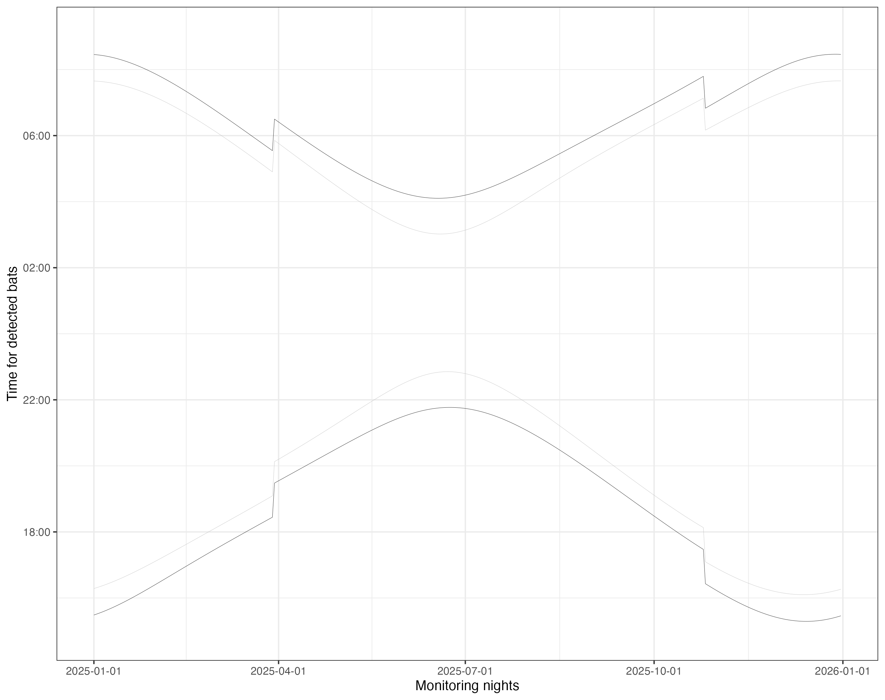

# Sun Moon Calculator

When monitoring bat activities it is useful to know when
sunset, dusk, dawn, sunrise, moonrise and moonset occurs,
as well as the phases of the moon.

With this python tool that can be calculated for a specific location.
There is also an example script in R showing how to use it when plotting data.

It is possible to create an executable file
(like "sun_moon_calculator.exe" in Windows)
to help people that are not using Python themselves.

## Result - example

Excel, LibreOffice, or Google drive can be used to open the file
that is produced by the calculator.

## R/RStudio example

This R project can be used as an inspiration for how to use the results.
https://github.com/cloudedbats/sun_moon_calculator/tree/main/r_example_plot

It also contains a test data file called "sun_moon_ottenby_2025.xlsx"
and the resulting plot looks like this:

## Installation

Installation instruction for Linux/macOS users:

    git clone https://github.com/cloudedbats/sun_moon_calculator.git
    cd sun_moon_calculator
    python3 -m venv venv
    source venv/bin/activate
    pip install -r requirements.txt

Installation instruction for Windows users
(where Python is installed at "C:\Python313\"):

    git clone https://github.com/cloudedbats/sun_moon_calculator.git
    cd plankton-sun_moon_calculator
    C:\Python313\python.exe -m venv venv
    venv\Scripts\activate
    pip install -r requirements.txt

## Run the Sun Moon Calculator

    cd sun_moon_calculator
    source venv/bin/activate # For Linux/macOS.
    # venv\Scripts\activate # For Windows.

    python sun_moon_cli.py

CLI means Command Line Interface and it will look something like this:

    > python3 sun_moon_cli.py
    Sun moon calculator
    -------------------
    This tool will create an Excel file with daily information 
    about sunset, dusk, dawn, sunrise, and similar for the moon.
    
    Source code: https://github.com/cloudedbats/sun_moon_calculator

    Input used by the Sun moon calculator is position and year.
    Position should be given as latitude and longitude, both in
    the decimal degree format with decimal point, see default values.
    A name for the position can be set, but is not mandatory.
    Press Ctrl-C to terminate.
    
    Latitude [57.89]: 56.2
    Longitude [12.34]: 16.4
    Year [2025]: 2025
    Name (optional) []: ottenby

## Create an executable file

This is about how to create an executable file for people who
don't want to use Python.

It is not recommended to run exe files created by people you don't know.
I will not publish exe files openly myself, just share with friends.

    # Skip this if already done.
    cd sun_moon_calculator
    source venv/bin/activate # For Linux/macOS.
    # venv\Scripts\activate # For Windows.

    # Create the executable.
    pyinstaller sun_moon_cli.spec

The produced executable is to be found here: "dist".
